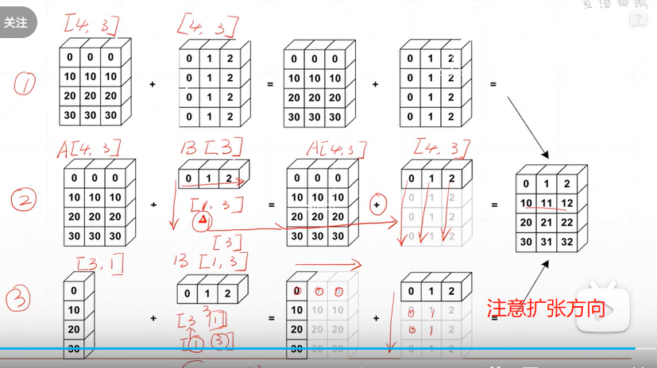

# 0.Intro
2. https://www.bilibili.com/video/BV18g4119737?p=24&vd_source=70200f7d09862fd682e5f89b22c89125
3. Broadcasting：unsqueeze的简便操作
    - 自动expand dim
    - 扩张时不拷贝数据
4. 重点
    - 怎么匹配，怎么理解，究竟是哪个维度的扩张
    - dim和shape
# 1. key ideas of broadcasting
1. key ideas of broadcasting
    - insert 1 dim ahead: 从**最小的维度(后面的维度是小维度)开始匹配，没有维度的话从前面开始匹配**
        - 对于一个feature maps大小为:[4,32,14,14]，需要对32个chanel添加bias。
        - 因此把32先**手动**添加[1,1]这两个维度-->[32,1,1]，然后从小维度开始对齐，发现[4]这个维度对不齐
        - 因此broacast可以自动扩张最后这个维度-->[1,32,1,1]
    - expand dims with size 1 to same size
        - 在把bias扩张成[1,32,1,1]的维度之后，现在`dim`一样都是4，但是shape不同。
        - broacast会对`size=1`的继续扩张成相同的size(shape)-->[4,32,14,14]
        - 现在可以进行元素之间对应位置的相加
2. 图解广播机制

# 2. why and when broadcast
1. 实际的case：我想对表示为`[class,students,scores]`这样的一个data的每一个数据上+5 scores，广播机制就可以轻松做到
2. 如何判断是否能够broadcast：
     - Match from ***LAST DIM***
     - 上面的例子是对**每门课所有学生**的成绩+5分的操作：A+B，其中A的shape是[8,32,8],B是一个shape为[1]的数据比如[5]
     - 如果我想对某一门课的所有学生进行加分，B应该是一个shape为[8]的数据比如[0,0,5,0,0,0,0,0]

# 3. Broadcasting situations
1. A的shape是[4,32,14,14],B的shape是[1,32,1,1]
    - 意义：对于所有chanel的所有pixel叠加一个（同样的）值比如bias
    - B会自动广播到[4,32,14,14]然后可以叠加，这里只涉及到复制的操作，并没有dim上的扩张
2. A的shape是[4,32,14,14],B的shape是[14,14]
    - 不管哪个通道，哪个batch，都叠加一个B
    - B会先扩张到[1,1,14,14],然后复制到[4,32,14,14]，然后可以叠加
3. A的shape是[4,32,14,14],B的shape是[2,32,14,14]
    - 意义不明确，你不能指定一半"2"，如果是[32,14,14]就可以广播
        - dim 0 has dim, can NOT insert and expand to same
        - dim 0 has distinct dim, NOT size 1
        - not broadcasting-able
    - 只能手动完成，复制一遍而已

# 4. 如何理解
1. 如何理解广播：
    - When it has no dim
        - treat it as all own the same，没给dim就意味着都一样
        - `[class,students,scores]` + `[scores]`，给所有同学加分
    - When it has dim of size 1
        - treat it shared by all,给了dim就意味着“这个dim很特殊”
        - `[class,students,scores]` + `[student,1]`，给某个特殊同学加分
2. A.shape=[4,3,32,32]
    - B.shape = [32,32], 表示给每个batch每个chanel的图片叠加一个B，达到平移的效果
    - B.shape = [3,1,1], 表示给每个chanel分别叠加一个相同的值，达到给RGB的chanel分别调节的效果
    - B.shape = [1,1,1,1]或者[1], 表示给每个batch每个chanel的每个pixel添加一个像素值